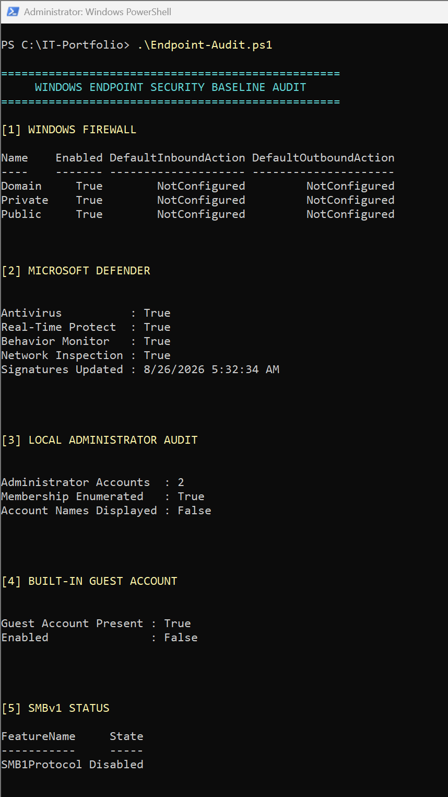
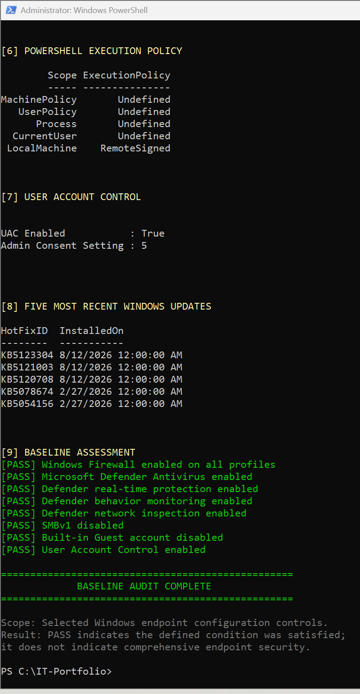

# Windows Endpoint Security Baseline Audit

A read-only PowerShell utility for collecting selected Windows endpoint security configuration data and evaluating defined controls against a simple PASS/WARN baseline.

## Overview

This project builds on basic Windows endpoint information collection by introducing security-focused configuration auditing and conditional assessment.

The script queries several Windows security controls, presents their current configuration, and evaluates selected conditions using clear **PASS/WARN** results.

The script is **read-only** and does not modify Windows configuration.

## Audited Areas

The script examines:

- Windows Firewall across Domain, Private, and Public profiles
- Microsoft Defender Antivirus status
- Microsoft Defender real-time protection
- Microsoft Defender behavior monitoring
- Microsoft Defender network inspection
- Local administrator membership
- Built-in Guest account status
- SMBv1 configuration
- PowerShell execution policy
- User Account Control
- Recently installed Windows hotfix information

## Baseline Assessment

The script evaluates the following conditions:

- Windows Firewall enabled across all profiles
- Microsoft Defender Antivirus enabled
- Defender real-time protection enabled
- Defender behavior monitoring enabled
- Defender network inspection enabled
- SMBv1 disabled
- Built-in Guest account disabled
- User Account Control enabled

Each evaluated condition produces either:

- **PASS** — the defined condition was satisfied
- **WARN** — the defined condition was not satisfied

A PASS result applies only to the specific condition tested by the script.

**PASS does not mean that the endpoint is comprehensively secure.**

## Informational Checks

Some information is collected for visibility without being independently scored as a PASS/WARN control.

### Local Administrators

The script enumerates membership of the built-in Windows Administrators group using SID:

`S-1-5-32-544`

This avoids relying solely on the English group name.

For privacy, the public-facing output displays:

- Number of administrator accounts
- Whether membership was successfully enumerated
- Confirmation that account names are not displayed

The script intentionally does not publish local administrator account names.

Administrator membership still requires contextual and manual review because the appropriate number and identity of privileged accounts depends on the environment.

### PowerShell Execution Policy

The script displays the current PowerShell execution-policy configuration across available scopes.

Execution policy is included for administrative visibility and should not be interpreted as a comprehensive PowerShell security control or security boundary.

### Installed Hotfixes

The script uses `Get-HotFix` to display the five most recently reported installed hotfixes.

This provides visibility into recent servicing activity but does **not** establish that all applicable Windows updates or security patches are installed.

## Requirements

- Windows 10 or Windows 11
- Windows PowerShell 5.1 or a compatible Windows environment
- Microsoft Defender cmdlets
- Local Accounts cmdlets
- Windows Firewall cmdlets
- Administrator privileges recommended

Some checks, particularly Windows optional-feature and security-configuration queries, may require an elevated PowerShell session.

## Usage

Open PowerShell as Administrator, navigate to the directory containing the script, and run:

```powershell
.\Endpoint-Audit.ps1
```

The script performs read-only queries and does not automatically remediate findings.

## Example Output

The audit output is divided into numbered sections for easier review.

### Configuration Collection



This portion of the audit displays Windows Firewall, Microsoft Defender, local administrator, built-in Guest account, and SMBv1 information.

### Baseline Assessment



This portion displays PowerShell execution policy, User Account Control, recent hotfix information, and the resulting PASS/WARN baseline assessment.

The screenshots represent a successful local test run of the project.

## PowerShell Concepts Demonstrated

This project uses several Windows administration and PowerShell concepts, including:

- `Get-NetFirewallProfile`
- `Get-MpComputerStatus`
- `Get-LocalGroup`
- `Get-LocalGroupMember`
- `Get-LocalUser`
- Windows security identifiers (SIDs)
- `Get-WindowsOptionalFeature`
- `Get-ExecutionPolicy`
- Registry configuration queries
- `Get-HotFix`
- `PSCustomObject`
- PowerShell pipelines
- Filtering and sorting
- Conditional logic
- Formatted console output

## Purpose

I created this project to move beyond simply collecting endpoint information and begin evaluating selected Windows security configuration against defined conditions.

The project demonstrates a basic security-assessment workflow:

**Define desired state → collect current state → evaluate deviations → remediate where justified → verify**

This version focuses on **collection and evaluation**.

It does not automatically remediate findings.

## Scope and Limitations

This project is a lightweight educational Windows endpoint security-auditing utility.

It is not:

- A vulnerability scanner
- An endpoint detection and response platform
- A complete endpoint-security assessment
- A CIS Benchmark implementation
- A Microsoft Security Baseline implementation
- A compliance assessment or certification tool
- Proof that an endpoint is secure

The baseline evaluates only the conditions explicitly implemented in the script.

Firewall default inbound and outbound actions are displayed for visibility, while the automated firewall result evaluates whether the firewall profiles are enabled.

Local administrator membership requires manual review and is not evaluated solely on account count.

The five displayed hotfixes should not be interpreted as a complete Windows Update or patch-compliance assessment.

No formal security-framework or compliance mapping is claimed.

## Safety

The script performs read-only queries.

It does not:

- Change Windows Firewall configuration
- Change Microsoft Defender settings
- Add or remove administrator accounts
- Enable or disable user accounts
- Enable or disable SMBv1
- Change PowerShell execution policy
- Change User Account Control
- Install or remove Windows updates
- Modify registry configuration
- Automatically remediate findings

## Future Improvements

Potential future development includes:

- Explicit UNKNOWN handling for unavailable control data
- Additional error handling
- Human-readable UAC consent-policy descriptions
- PASS/WARN/UNKNOWN summary totals
- BitLocker status
- Secure Boot status
- Remote Desktop configuration
- Additional Microsoft Defender controls
- Password-policy auditing
- Event-log configuration
- CSV or JSON report export
- Optional formal benchmark mappings
- Separate remediation tooling

These are potential future improvements and are intentionally outside the current version.

## License

This project is licensed under the MIT License. See `LICENSE` for details.